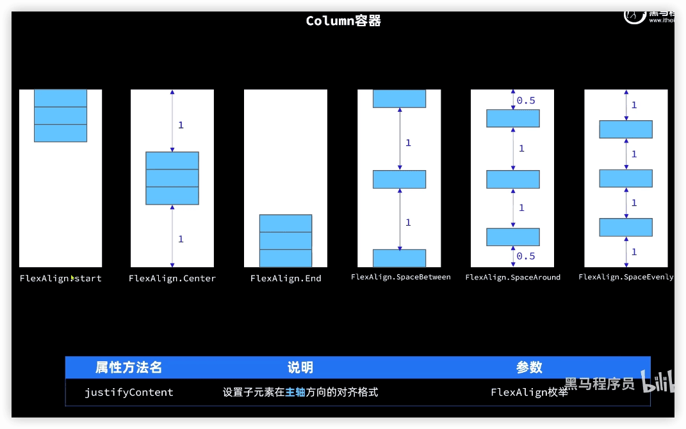
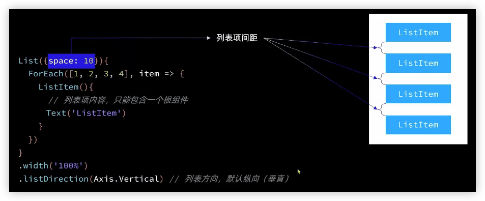

HarmonyOS开发应用从入门到实战
---

[HarmonyOS4+NEXT星河版入门到企业级实战教程](https://www.bilibili.com/video/BV1Sa4y1Z7B1)


## 介绍

`鸿蒙OS = 开源鸿蒙 + 安卓兼容层 + 华为自研的能力（不开源）`

华为自研能力是什么意思呢？举个例子，华为有个骨节敲击截屏的功能，这个功能是其他手机都没有的，是它自研的算法，所以它不开源，不对外，形成自己的特色，并用专利保护起来，形成壁垒和行业差异化竞争。

`鸿蒙OS Next = 开源鸿蒙 + 华为自研能力（不开源）`

开源鸿蒙是鸿蒙最基础的形态，但是由于初始阶段，不成熟也没有配套的软件（微信，淘宝和抖音没有纯鸿蒙版本），所以必须加了安卓兼容层，野蛮生长，经过了4年多的迭代，系统已经成熟了，可以剔除安卓兼容层了。


> 安卓
>
> GMS（谷歌移动服务），   收费的部分。【对应华为HMS Core】
>
> AOSP（Android Open Source Project，Android 开放源代码项目）

### 鸿蒙开发用语言

两种开发方向：

- 系统级别的开发，比如驱动，内核和框架层的开发，这种开发以C/C++为主
- 应用级别的开发，从API8开始，只能用Arkts（ets），js或着C++开发了


ets的性能在正常情况下是无法比得过Java的执行效率，而在方舟编译器和毕昇编译器的特别优化下，可以取得更高地执行效率；之所以选择ts作为开发语言，因为每一个系统都需要配套的生态软件才能长久，而Java需要拖一个JVM，会降低运行效率，而C++门槛比较高，所以选择了有一定开发者基数，没有版权问题，且还能通过编译器提高运行效率的语言，所以华为选择了TypeScript。


### 宏内核和微内核

宏内核

微内核

混合内核


#### 鸿蒙设备分级


1、Linux 面向手机 (L5级别设备) 

2、LiteOS-a 面向有MMU的设备 (>=L1级别且<L5) 

3、LiteOS-m 面向无MMU的嵌入式设备 (L0级别)

目前并非所有的鸿蒙版本都是使用的微内核，对于L5以下的设备，由于设备功能比较单一， 不需要那么多功能，所以资源的分配和争夺并不激烈，是可以通过微内核达到自由裁剪的目的，一次开发多段部署。

> MMU是Memory Management Unit的缩写，中文名是==内存管理单元==，有时称作==分页内存管理单元==（英语：paged memory management unit，缩写为PMMU）。它是一种负责处理中央处理器（CPU）的内存访问请求的计算机硬件。它的功能包括虚拟地址到物理地址的转换（即虚拟内存管理）、内存保护、中央处理器高速缓存的控制，在较为简单的计算机体系结构中，负责总线的仲裁以及存储体切换（bank switching，尤其是在8位的系统上）。


微内核和宏内核各有各的好处，而现在鸿蒙系统，除了L5级别，由于设备的高要求，无法达到所需的高实时性，还用着Linux的内核，其他设备已经全部使用鸿蒙内核（LiteOS-m和LiteOS-A，根据设备的等级，选择不同的内核），希望在华为的努力下，L5也可以接入微内核，让我们一起期待！


### 课程介绍


### ohpm

https://ohpm.openharmony.cn/

OHPM（OpenHarmony Package Manager）由OpenHarmony三方库中心仓网站、命令行工具、OpenHarmony三方库中心仓仓库三个部分组成。

## 1 开发准备

### 熟悉鸿蒙官网

https://developer.harmonyos.com/

https://developer.huawei.com/consumer/cn/


### 安装DevEco Studio


### 工程目录介绍


- `AppScope`中存放应用全局所需要的资源文件。
- `entry`是应用的主模块，存放HarmonyOS应用的代码、资源等。
- `oh_modules`是工程的依赖包，存放工程依赖的源文件。

- `build-profile.json5`是工程级配置信息，包括签名、产品配置等。

- `hvigorfile.ts`是工程级编译构建任务脚本，hvigor是基于任务管理机制实现的一款全新的自动化构建工具，主要提供任务注册编排，工程模型管理、配置管理等核心能力。

- `oh-package.json5`是工程级依赖配置文件，用于记录引入包的配置信息。

#### AppScope目录


- 其中element文件夹主要存放公共的字符串、布局文件等资源。
- media存放全局公共的多媒体资源文件。

`AppScope>app.json5`是应用的全局的配置文件，用于存放应用公共的配置信息。 其中配置信息如下：

- bundleName是包名。
- vendor是应用程序供应商。
- versionCode是用于区分应用版本。
- versionName是版本号。
- icon对应于应用的显示图标。
- label是应用名。

#### entry目录


`entry>src`目录中主要包含总的main文件夹，单元测试目录ohosTest，以及模块级的配置文件。

- main文件夹中，ets文件夹用于存放ets代码，resources文件存放模块内的多媒体及布局文件等，module.json5文件为模块的配置文件。

- ohosTest是单元测试目录。

- build-profile.json5是模块级配置信息，包括编译构建配置项。

- hvigorfile.ts文件是模块级构建脚本。
- oh-package.json5是模块级依赖配置信息文件。

`entry>src>main>ets`目录中有：

- entryability存放ability文件，用于当前ability应用逻辑和生命周期管理。
- pages存放UI界面相关代码文件，初始会生成一个Index页面。

`entry>src>main>resources`目录下存放模块公共的多媒体、字符串及布局文件、国际化等资源。


`entry>src>main>module.json5`是模块的配置文件，包含当前模块的配置信息。[配置详细官方文档](https://developer.huawei.com/consumer/cn/doc/harmonyos-guides-V2/module-configuration-file-0000001427744540-V2)


`entry>src/main/resources/base/profile/main_pages.json`文件保存的是页面page的路径配置信息，所有需要进行路由跳转的page页面都要在这里进行配置。


## 2 了解ArkTS语言

网页开发需要三门语言：


鸿蒙只需要ArkTS（语法和TypeScript类似）


ArkTS优势：

- 开发效率高、开发体验好
- 性能优越
- 有多系统适配，接入能力


### TypeScript语法

#### 变量声明

TypeScript在JavaScript的基础上加入了静态类型检查功能，因此每一个变量都有固定的数据类型。

```typescript
let msg: string = 'hello world'
```


[TypeScript官方网站](https://www.typescriptlang.org/)提供了ts的运行环境：https://www.typescriptlang.org/play

#### 条件控制

if-else  

switch

```typescript
let num: number = 21

if (num % 2 === 0) {
	console.log(num + '是偶数')
} else {
  console.log(num + '是奇数')
}

if (num > 0) {
  console.log(num + '是正数')
} else if (num < 0) {
  console.log(num + '是负数')
} else {
  console.log(num + '为0')
}
```

> 在TypeScript中，空字符串、数字0、null、undefined都被认为是false，其它值则为true。

```typescript
let grade: string = 'A'
switch (grade) {
  case 'A': {
    console.log('优秀')
    break
  }
  case 'B': {
    console.log('合格')
    break
  }
  case 'C': {
    console.log('不合格')
    break
  }
  default: {
    console.log('非法输入')
    break
  }
}
```

#### 循环迭代

for

while

为一些内置类型如Array等提供了快捷迭代语法。

```typescript
let names: string[] = ['jack', 'rose']
// for in 迭代器，遍历得到数组角标
for (const i in names) {
  console.log(i + ':' + names[i])
}
// for of 迭代器，直接得到元素
for (const name of names) {
  console.log(name)
}
```

#### 函数

利用`function`关键字声明函数，并且支持可选参数、默认参数、箭头函数等特殊语法。

```typescript
// 无返回值函数，返回值void可以省略
function sayHello(name: string): void {
  console.log('你好, ' + name + '!')
}
sayHello("andy")

// 有返回值函数
function sum(x: number, y: number): number {
  return x + y
}
let res = sum(21, 18)
console.log('21 + 18 = ' + res)

// 箭头函数
let sayHi = (name: string) => {
  console.log('你好, ' + name + '!')
}
sayHi('rose')

// 可选参数，在参数名后加?，表示该参数是可选地的
function sayHello2(name?: string) {
  // 判断name是否有值，如果无值则给一个默认值
  name = name ? name : '陌生人'
  console.log('你好, ' + name + '!')
}
sayHello2('andy')
sayHello2()

// 参数默认值，如果调用者没有传参，则使用默认值
function sayHello3(name: string = '陌生人') {
  console.log('你好, ' + name + '!')
}
sayHello3('tom')
sayHello3()
```

#### 类和接口

TypeScript具备面向对象编程的基本语法，例如interface、class、enum等。也具备封装、继承、多态等面向对象基本特征

```typescript
// 枚举，可以赋值，如果不赋值就是数字
enum Msg {
  HI = 'Hi',
  HELLO = 'Hello'
}

// 定义接口
interface A {
  say(msg: Msg): void
}
// 实现接口
class B implements A {
  say(msg: Msg): void {
    console.log(msg + ', I am B')
  }
}

// 初始化对象
let a: A = new B() 
// 调用方法
a.say(Msg.HI)
```


#### 模块开发

应用复杂时，可以通过通用功能抽取到单独的ts文件中，每个文件都是一个模块（module），模块可以相互加载，提高代码复用性。


## 3 快速入门


 


`@Entry`，入口组件可以被独立访问


## 4 基础组件


### Image


> [安装模拟器](https://b11et3un53m.feishu.cn/wiki/LGprwXi1biC7TQkWPNDc45IXndh)

网络图片，需要配置权限：[安全-访问控制](https://developer.harmonyos.com/cn/docs/documentation/doc-guides-V3/accesstoken-overview-0000001544703857-V3)

文件`module.json5`：

```json
{
  "module": {
    "requestPermissions": [
      {
        "name": "ohos.permission.INTERNET"
      }
    ],
```

> ide中，鼠标悬乎看文档


### Text：文本显示组件


base目录相当于一个默认目录


### TextInput：文本输入框


### Button


### Slider:滑动条组件


## 5 页面布局





## 6 渲染控制

`ForEach`


`if else`


## 7 列表布局

多个Row布局不支持滚动效果

列表（List）是一种复杂容器，具备下列特点：

1. 列表项（ListItem）数量过多超出屏幕后，会自动提供滚动功能
2. 列表项（ListItem）既可以纵向排列，也可以横向排列


注意：`ListItem`不是容器。List中只能有ListItem，而且ListItem中只有一个容器。



## 8 自定义组件

### 自定义组件


### 自定义构建函数

可以定义子啊全局或组件内

```typescript
// 全局自定义构建函数
@Builder function ItemCard(item: Item) {
  // ...
}

@Entry
@Component
struct ItemPage {
  // ...
              ItemCard(item)
  // ...
  }
}
```

```typescript
@Entry
@Component
struct ItemPage {
  // ...
              this.ItemCard(item)
  // ...

  // 局部自定义构建函数
  @Builder  ItemCard(item: Item) {
  // ...
  }
}
```


### 公共样式函数

`@Styles`装饰器，仅可以封装组件通用属性

```typescript
// 全局公共样式函数
@Styles function fillScreen() {
  .width('100%')
  .height('100%')
  .padding(20)
  .backgroundColor('#EFEFEF')
}

@Entry
@Component
struct ItemPage {

  build() {
    Column({space: 8}) {

    }
    .fillScreen()
  }
}
```

```typescript
@Entry
@Component
struct ItemPage {
  build() {
    Column({space: 8}) {

    }
    .fillScreen()
  }
  
  // 局部公共样式函数
  @Styles fillScreen() {
  }
}
```

`@Extend`可以用来配置组件特有属性，但必须定义在全局

```typescript
// 样式的继承模式。只能是全局
@Extend(Text) function priceText() {
  .fontSize(18)
  .fontColor('#F36')
}
```

## 9 状态管理

### @State

在声明式UI中，是以状态驱动视图更新：


- 状态（State）：指驱动视图更新的数据（被装饰器标记的变量）
- 视图（View）：基于UI描述渲染得到用户界面


> 说明
>
> - @State装饰器标记的变量必须初始化，不能为空值。
> - @State支持Object、class、string、number、boolean、enum类型以及这些类型的数组。
> - 嵌套类型以及数组中的对象属性无法触发视图更新。但数组的对象添加、删除、重新赋值会触发试图更新。

### 任务统计案例


### 数据同步

当父子组件之间需要数据同步是，可以使用`@Prop`和`@Link`装饰器：


@Prop单向传递是复制，@Link双向传递是传递引用，操作是统一变量。


@Provide和Consume可以**跨组件**提供类似于@State和@Link的双向同步。

P16 24:00

### @Observed和@ObjectLink


## 10 页面路由


## 11 动画


### 属性动画


### 显式动画


### 组件转场动画


## 12 Stage模型


## 13 网络连接

### Http数据请求


### 第三方库axios


## 14 数据持久化

### 用户首选项


### 关系型数据库


## 15 通知

基础通知

进度条通知

通知意图


## 16 实战案例

健康
