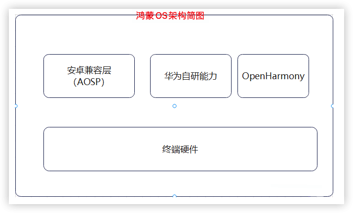
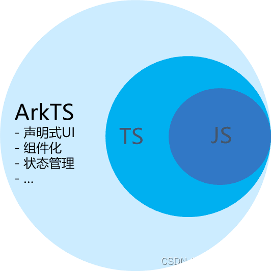
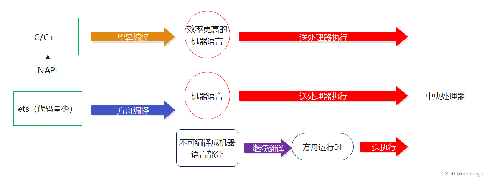
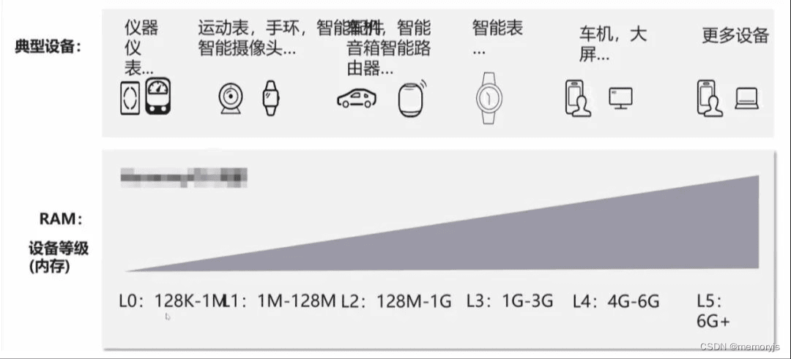
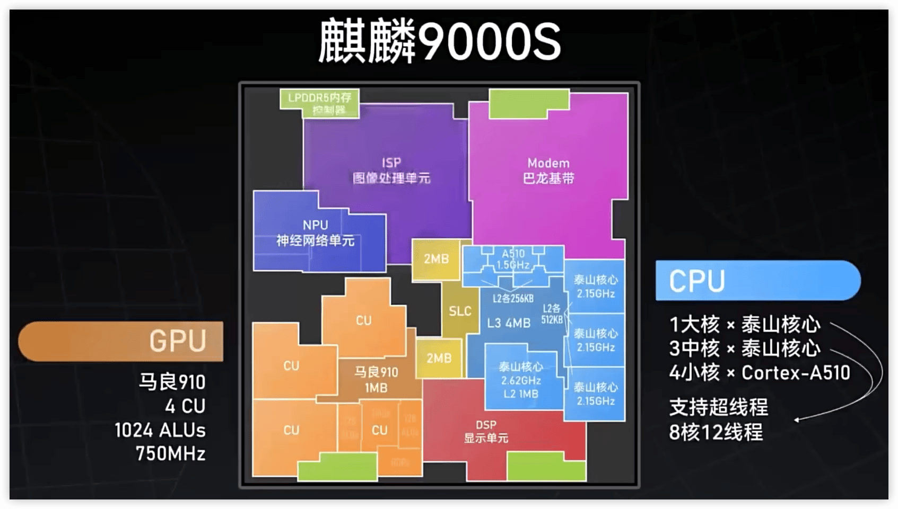
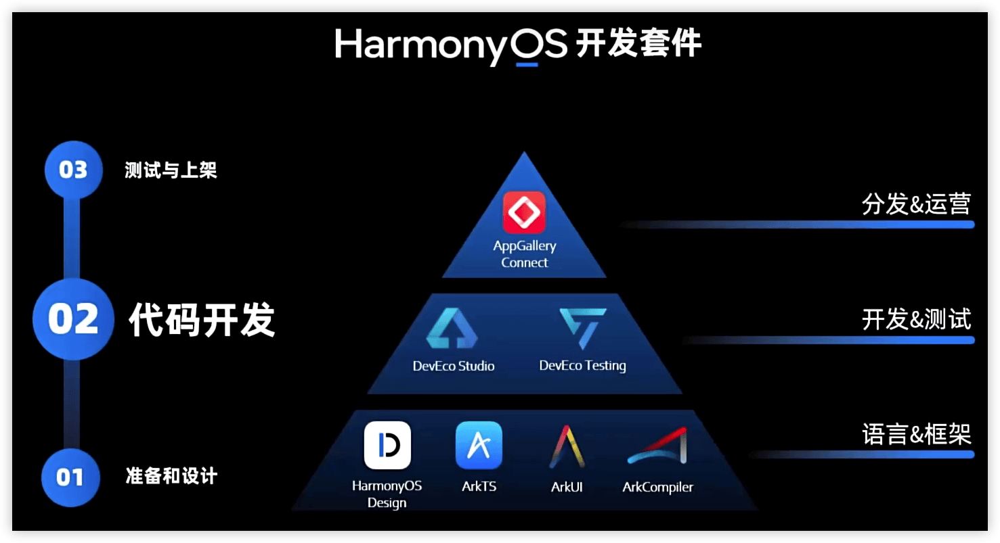
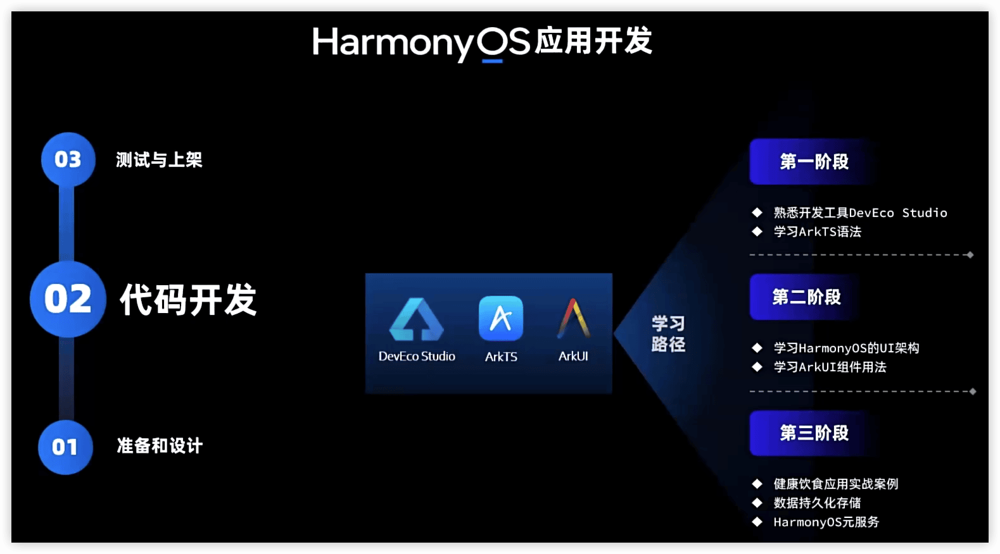

HarmonyOS4.0开发应用从入门到实战
---

https://www.bilibili.com/video/BV1Sa4y1Z7B1

## 介绍

`鸿蒙OS = 开源鸿蒙 + 安卓兼容层 + 华为自研的能力（不开源）`

华为自研能力是什么意思呢？举个例子，华为有个骨节敲击截屏的功能，这个功能是其他手机都没有的，是它自研的算法，所以它不开源，不对外，形成自己的特色，并用专利保护起来，形成壁垒和行业差异化竞争。

`鸿蒙OS Next = 开源鸿蒙 + 华为自研能力（不开源）`

开源鸿蒙是鸿蒙最基础的形态，但是由于初始阶段，不成熟也没有配套的软件（微信，淘宝和抖音没有纯鸿蒙版本），所以必须加了安卓兼容层，野蛮生长，经过了4年多的迭代，系统已经成熟了，可以剔除安卓兼容层了。

### 鸿蒙开发用语言

两种开发方向：

- 系统级别的开发，比如驱动，内核和框架层的开发，这种开发以C/C++为主
- 应用级别的开发，从API8开始，只能用Arkts（ets），js或着C++开发了

ets的性能在正常情况下是无法比得过Java的执行效率，而在方舟编译器和毕昇编译器的特别优化下，可以取得更高地执行效率；之所以选择ts作为开发语言，因为每一个系统都需要配套的生态软件才能长久，而Java需要拖一个JVM，会降低运行效率，而C++门槛比较高，所以选择了有一定开发者基数，没有版权问题，且还能通过编译器提高运行效率的语言，所以华为选择了TypeScript。

### 宏内核和微内核

宏内核

微内核

混合内核

#### 鸿蒙设备分级

1、Linux 面向手机 (L5级别设备) 

2、LiteOS-a 面向有MMU的设备 (>=L1级别且<L5) 

3、LiteOS-m 面向无MMU的嵌入式设备 (L0级别)

目前并非所有的鸿蒙版本都是使用的微内核，对于L5以下的设备，由于设备功能比较单一， 不需要那么多功能，所以资源的分配和争夺并不激烈，是可以通过微内核达到自由裁剪的目的，一次开发多段部署。

> MMU是Memory Management Unit的缩写，中文名是内存管理单元，有时称作分页内存管理单元（英语：paged memory management unit，缩写为PMMU）。它是一种负责处理中央处理器（CPU）的内存访问请求的计算机硬件。它的功能包括虚拟地址到物理地址的转换（即虚拟内存管理）、内存保护、中央处理器高速缓存的控制，在较为简单的计算机体系结构中，负责总线的仲裁以及存储体切换（bank switching，尤其是在8位的系统上）。

微内核和宏内核各有各的好处，而现在鸿蒙系统，除了L5级别，由于设备的高要求，无法达到所需的高实时性，还用着Linux的内核，其他设备已经全部使用鸿蒙内核（LiteOS-m和LiteOS-A，根据设备的等级，选择不同的内核），希望在华为的努力下，L5也可以接入微内核，让我们一起期待！

### 课程介绍

## 1 开发准备

### 熟悉鸿蒙官网

https://developer.harmonyos.com/

https://developer.huawei.com/consumer/cn/

### 安装DevEco Studio

🔖 安装sdk失败

### 了解ArkTS语言

